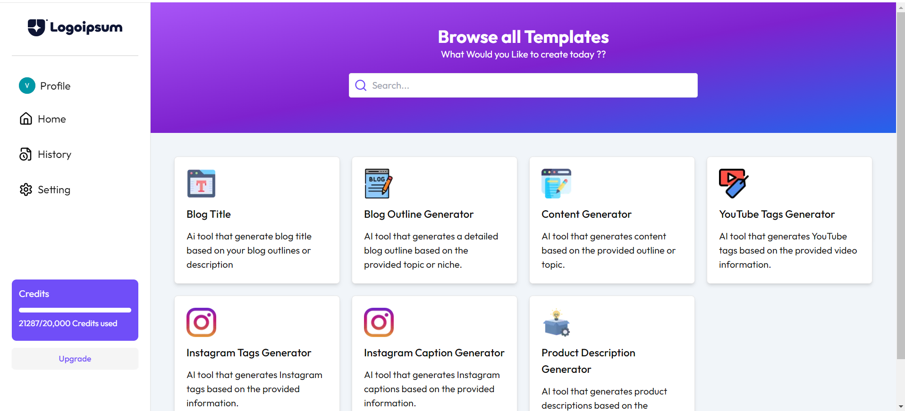

# AI Content Generation 

This project is an AI Content Generation Dashboard built using Next.js, Drizzle ORM, NEON PostgreSQL, Tailwind CSS, and TypeScript (tsx). The dashboard allows users to generate AI content and view their history of generated content.

## Tech Stack

- **Next.js**: A React framework for production.
- **Drizzle ORM**: A TypeScript ORM for PostgreSQL.
- **NEON PostgreSQL**: A serverless PostgreSQL database.
- **Tailwind CSS**: A utility-first CSS framework for styling.
- **TypeScript**: A superset of JavaScript with static types.

## Features

- **AI Content Generation**: Generate content using the Google Gemini API.
- **User Authentication**: Secure user authentication using Clerk.
- **Content History**: View the history of AI-generated content, filtered by the user's email.
- **Responsive Design**: Fully responsive design using Tailwind CSS.
- **Copy to Clipboard**: Easily copy AI-generated responses to the clipboard.

## Setup and Installation

### Prerequisites

- Node.js
- PostgreSQL

### Installation

1. **Clone the Repository**
    \`\`\`bash
    git clone https://github.com/Varunv003/Ai-content_generator-nextjs
    cd ai-content-generation-dashboard
    \`\`\`

2. **Install Dependencies**
    \`\`\`bash
    npm install
    \`\`\`

3. **Set Up Environment Variables**
    Create a \`.env.local\` file in the root directory and add the following environment variables:
    \`\`\`env
    NEXT_PUBLIC_DRIZZLE_DB_URL=your-neon-postgresql-url
    NEXT_PUBLIC_CLERK_PUBLISHABLE_KEY=your-clerk-publishable-key
    CLERK_SECRET_KEY=your-clerk-secret-key
    GOOGLE_GEMINI_API_KEY=your-google-gemini-api-key

    NEXT_PUBLIC_CLERK_SIGN_IN_URL=/sign-in
    NEXT_PUBLIC_CLERK_SIGN_UP_URL=/sign-up
    \`\`\`

4. **Run Database Migrations**
    \`\`\`bash
    npm run db:migrate
    \`\`\`

5. **Start the Development Server**
    \`\`\`bash
    npm run dev
    \`\`\`

6. **Visit the Application**
    Open your browser and go to \`http://localhost:3000\`.

## Folder Structure

- \`components/\`: React components used in the project.
- \`pages/\`: Next.js pages, including the history page.
- \`styles/\`: Global styles and Tailwind CSS configuration.
- \`utils/\`: Utility files, including database configuration and schema.

## Database Schema

The database schema is defined in \`utils/schema.tsx\`

